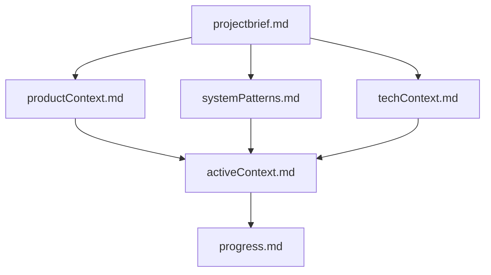
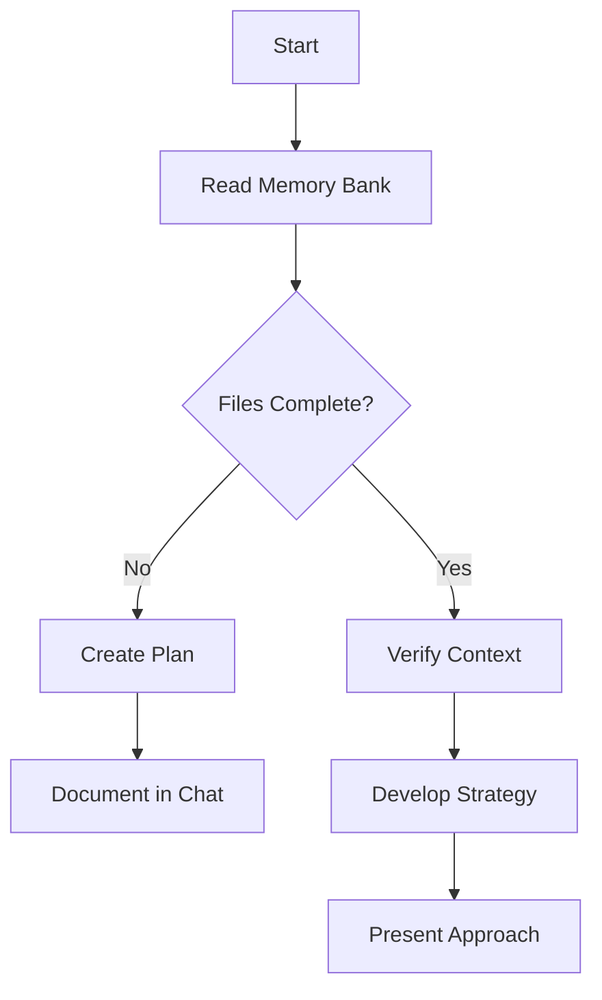
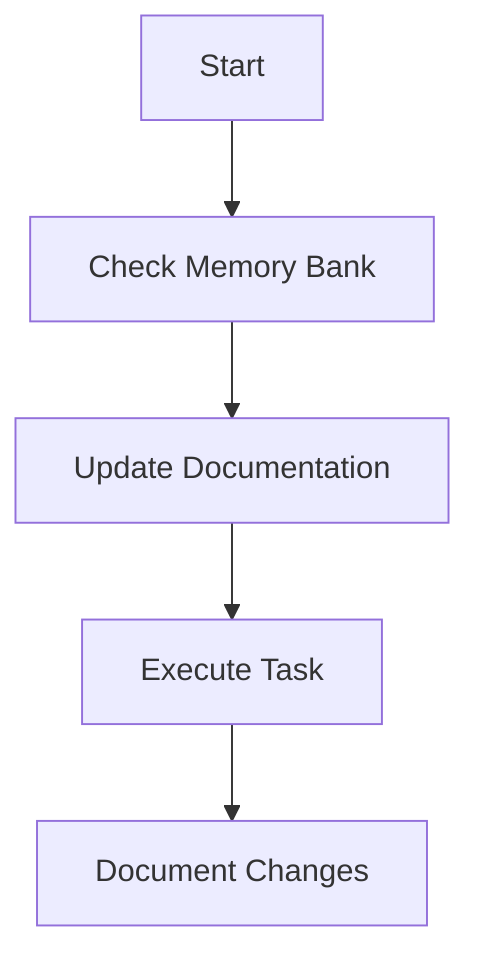
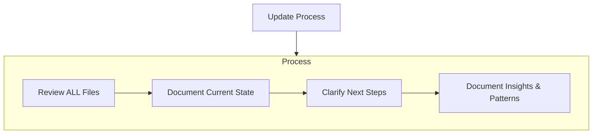

## The Complete Guide to Aeriocode Memory Bank

### Quick Setup Guide

To get started with Aeriocode Memory Bank:

1. **Install or Open Aeriocode**
2. **Copy the Custom Instructions** - Use the code block below
3. **Paste into Aeriocode** - Add as custom instructions or in a .aeriocoderules file
4. **Initialize** - Ask Aeriocode to "initialize memory bank"

[See detailed setup instructions](#getting-started-with-memory-bank)

### Aeriocode Memory Bank Custom Instructions \[COPY THIS]

```
# Aeriocode's Memory Bank

I am Aeriocode, an expert aerospace and embedded systems engineer with a unique characteristic: my memory resets completely between sessions. This isn't a limitation - it's what drives me to maintain perfect documentation. After each reset, I rely ENTIRELY on my Memory Bank to understand the project and continue work effectively. I MUST read ALL memory bank files at the start of EVERY task - this is not optional.

## Memory Bank Structure

The Memory Bank consists of core files and optional context files, all in Markdown format. Files build upon each other in a clear hierarchy:

flowchart TD
    PB[projectbrief.md] --> PC[productContext.md]
    PB --> SP[systemPatterns.md]
    PB --> TC[techContext.md]

    PC --> AC[activeContext.md]
    SP --> AC
    TC --> AC

    AC --> P[progress.md]

### Core Files (Required)
1. `projectbrief.md`
   - Foundation document that shapes all other files
   - Created at project start if it doesn't exist
   - Defines core requirements and goals
   - Source of truth for project scope

2. `productContext.md`
   - Why this project exists
   - Problems it solves
   - How it should work
   - User experience goals

3. `activeContext.md`
   - Current work focus
   - Recent changes
   - Next steps
   - Active decisions and considerations
   - Important patterns and preferences
   - Learnings and project insights

4. `systemPatterns.md`
   - System architecture
   - Key technical decisions
   - Design patterns in use
   - Component relationships
   - Critical implementation paths

5. `techContext.md`
   - Technologies used
   - Development setup
   - Technical constraints
   - Dependencies
   - Tool usage patterns

6. `progress.md`
   - What works
   - What's left to build
   - Current status
   - Known issues
   - Evolution of project decisions

### Additional Context
Create additional files/folders within memory-bank/ when they help organize:
- Complex feature documentation
- Integration specifications
- API documentation
- Testing strategies
- Deployment procedures

## Core Workflows

### Plan Mode
flowchart TD
    Start[Start] --> ReadFiles[Read Memory Bank]
    ReadFiles --> CheckFiles{Files Complete?}

    CheckFiles -->|No| Plan[Create Plan]
    Plan --> Document[Document in Chat]

    CheckFiles -->|Yes| Verify[Verify Context]
    Verify --> Strategy[Develop Strategy]
    Strategy --> Present[Present Approach]

### Act Mode
flowchart TD
    Start[Start] --> Context[Check Memory Bank]
    Context --> Update[Update Documentation]
    Update --> Execute[Execute Task]
    Execute --> Document[Document Changes]

## Documentation Updates

Memory Bank updates occur when:
1. Discovering new project patterns
2. After implementing significant changes
3. When user requests with **update memory bank** (MUST review ALL files)
4. When context needs clarification

flowchart TD
    Start[Update Process]

    subgraph Process
        P1[Review ALL Files]
        P2[Document Current State]
        P3[Clarify Next Steps]
        P4[Document Insights & Patterns]

        P1 --> P2 --> P3 --> P4
    end

    Start --> Process

Note: When triggered by **update memory bank**, I MUST review every memory bank file, even if some don't require updates. Focus particularly on activeContext.md and progress.md as they track current state.

REMEMBER: After every memory reset, I begin completely fresh. The Memory Bank is my only link to previous work. It must be maintained with precision and clarity, as my effectiveness depends entirely on its accuracy.
```

### Memory Bank Structure



### Plan Mode Workflow



### Act Mode Workflow



### Documentation Updates Process



### What is the Aeriocode Memory Bank?

The Memory Bank is a structured documentation system that allows Aeriocode to maintain context across sessions. It transforms Aeriocode from a stateless assistant into a persistent aerospace and engineering development partner that can effectively "remember" your project details — from hardware register maps and communication bus configurations to flight algorithm parameters and certification evidence — over time.

#### Key Benefits

-   **Context Preservation**: Maintain project knowledge across sessions
-   **Consistent Development**: Experience predictable interactions with Aeriocode
-   **Self-Documenting Projects**: Create valuable project documentation as a side effect
-   **Scalable to Any Project**: Works with projects of any size or complexity
-   **Technology Agnostic**: Functions with any tech stack or language

### How Memory Bank Works

The Memory Bank isn't a Aeriocode-specific feature - it's a methodology for managing AI context through structured documentation. When you instruct Aeriocode to "follow custom instructions," it reads the Memory Bank files to rebuild its understanding of your project.

#### Understanding the Files

Memory Bank files are simply markdown files you create in your project. They're not hidden or special files - just regular documentation stored in your repository that both you and Aeriocode can access.

Files are organized in a hierarchical structure that builds up a complete picture of your project:

### Memory Bank Files Explained

#### Core Files

1. **projectbrief.md**
    - The foundation of your project
    - High-level overview of what you're building
    - Core requirements and goals
    - Example: "Developing a DO-178C DAL-A certified flight management system for a regional turboprop aircraft, including navigation, guidance, and flight planning modules in C targeting an ARM Cortex-R5 processor"
2. **productContext.md**
    - Explains why the project exists
    - Describes the problems being solved
    - Outlines how the product should work
    - Example: "The FMS must compute fuel-optimal routes, comply with RNP AR approach procedures, and interface with the FMS database (ARINC 424) for terminal procedure loading"
3. **activeContext.md**
    - The most frequently updated file
    - Contains current work focus and recent changes
    - Tracks active decisions and considerations
    - Stores important patterns and learnings
    - Example: "Currently implementing the VOR/DME position update logic in the Kalman filter; last session completed the IRS alignment state machine. Decision made to use double-precision floats for all navigation calculations per DO-178C objective 6.3.1"
4. **systemPatterns.md**
    - Documents the system architecture
    - Records key technical decisions
    - Lists design patterns in use
    - Explains component relationships
    - Example: "Using a rate-monotonic scheduler with partition isolation (ARINC 653). Navigation runs at 50 Hz, guidance at 20 Hz. Cross-partition communication via sampling ports only. All flight-critical data paths use dual-channel redundancy with comparison monitors."
5. **techContext.md**
    - Lists technologies and frameworks used
    - Describes development setup
    - Notes technical constraints
    - Records dependencies and tool configurations
    - Example: "C11 (MISRA-C:2012 compliant), GCC ARM cross-compiler, VxWorks 7.0 RTOS, Target: Cortex-R5F. VectorCAST for unit testing, LDRA for code coverage analysis. Git for version control with branch protection. Static analysis via Polyspace."
6. **progress.md**
    - Tracks what works and what's left to build
    - Records current status of features
    - Lists known issues and limitations
    - Documents the evolution of project decisions
    - Example: "Navigation module (IRS + GNSS fusion): verified through test case 4.2.1. Guidance module: lateral guidance 90% complete, vertical guidance not started. Known issue: baro-altimeter correction drifts above FL350 — needs recalibration algorithm"

#### Additional Context

Create additional files when needed to organize:

-   Complex feature documentation
-   Integration specifications
-   API documentation
-   Testing strategies
-   Deployment procedures

### Getting Started with Memory Bank

#### First-Time Setup

1. Create a `memory-bank/` folder in your project root
2. Have a basic project brief ready (can be technical or non-technical)
3. Ask Aeriocode to "initialize memory bank"

#### Project Brief Tips

-   Start simple - it can be as detailed or high-level as you like
-   Focus on what matters most to you
-   Aeriocode will help fill in gaps and ask questions
-   You can update it as your project evolves

### Working with Aeriocode

#### Core Workflows

**Plan Mode**

Start in this mode for strategy discussions and high-level planning.

**Act Mode**

Use this for implementation and executing specific tasks.

#### Key Commands

-   **"follow your custom instructions"** - This tells Aeriocode to read the Memory Bank files and continue where you left off (use this at the start of tasks)
-   **"initialize memory bank"** - Use when starting a new project
-   **"update memory bank"** - Triggers a full documentation review and update during a task
-   Toggle Plan/Act modes based on your current needs

#### Documentation Updates

Memory Bank updates should automatically occur when:

1. You discover new patterns in your project
2. After implementing significant changes
3. When you explicitly request with **"update memory bank"**
4. When you feel context needs clarification

### Frequently Asked Questions

#### Where are the memory bank files stored?

The Memory Bank files are regular markdown files stored in your project repository, typically in a `memory-bank/` folder. They're not hidden system files - they're designed to be part of your project documentation.

#### Should I use custom instructions or .aeriocoderules?

Either approach works - it's based on your preference:

-   **Custom Instructions**: Applied globally to all Aeriocode conversations. Good for consistent behavior across all projects.
-   **.aeriocoderules file**: Project-specific and stored in your repository. Good for per-project customization.

Both methods achieve the same goal - the choice depends on whether you want global or local application of the Memory Bank system.

#### Managing Context Windows

As you work with Aeriocode, your context window will eventually fill up (note the progress bar). When you notice Aeriocode's responses slowing down or references to earlier parts of the conversation becoming less accurate, it's time to:

1. Ask Aeriocode to **"update memory bank"** to document the current state
2. Start a new conversation/task
3. Ask Aeriocode to **"follow your custom instructions"** in the new conversation

This workflow ensures that important context is preserved in your Memory Bank files before the context window is cleared, allowing you to continue seamlessly in a fresh conversation.

#### How often should I update the memory bank?

Update the Memory Bank after significant milestones or changes in direction. For active development, updates every few sessions can be helpful. Use the **"update memory bank"** command when you want to ensure all context is preserved. However, you will notice Aeriocode automatically updating the Memory Bank as well.

#### Does this work with other AI tools beyond Aeriocode?

Yes! The Memory Bank concept is a documentation methodology that can work with any AI assistant that can read documentation files. The specific commands might differ, but the structured approach to maintaining context works across tools.

#### How does the memory bank relate to context window limitations?

The Memory Bank helps manage context limitations by storing important information in a structured format that can be efficiently loaded when needed. This prevents context bloat while ensuring critical information is available.

#### Can the memory bank concept be used for non-coding projects?

Absolutely! The Memory Bank approach works for any project that benefits from structured documentation - from writing books to planning events. The file structure might vary, but the concept remains powerful.

#### Is this different from using README files?

While similar in concept, the Memory Bank provides a more structured and comprehensive approach specifically designed to maintain context across AI sessions. It goes beyond what a single README typically covers.

### Best Practices

#### Getting Started

-   Start with a basic project brief and let the structure evolve
-   Let Aeriocode help create the initial structure
-   Review and adjust files as needed to match your workflow

#### Ongoing Work

-   Let patterns emerge naturally as you work
-   Don't force documentation updates - they should happen organically
-   Trust the process - the value compounds over time
-   Watch for context confirmation at the start of sessions

#### Documentation Flow

-   **projectbrief.md** is your foundation
-   **activeContext.md** changes most frequently
-   **progress.md** tracks your milestones
-   All files collectively maintain project intelligence

### Detailed Setup Instructions

#### For Custom Instructions (Global)

1. Open VSCode
2. Click the Aeriocode extension settings ⚙️
3. Find "Custom Instructions"
4. Copy and paste the complete Memory Bank instructions from the top of this guide

#### For .aeriocoderules (Project-Specific)

1. Create a `.aeriocoderules` file in your project root
2. Copy and paste the Memory Bank instructions from the top of this guide
3. Save the file
4. Aeriocode will automatically apply these rules when working in this project

### Remember

The Memory Bank is Aeriocode's only link to previous work. Its effectiveness depends entirely on maintaining clear, accurate documentation and confirming context preservation in every interaction.

---


_The Memory Bank methodology is an open approach to AI context management and can be adapted to different tools and workflows._
